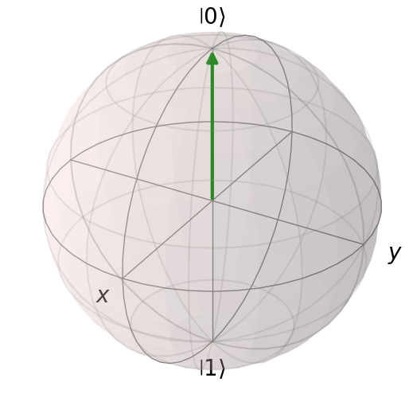
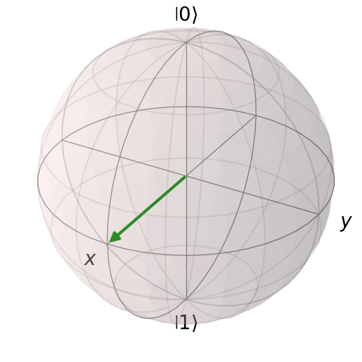
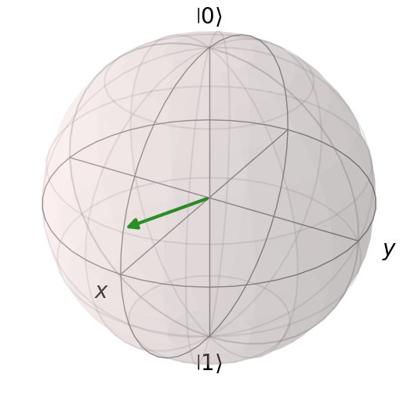

# Quantum State Visualization

A progressive Python-based study of single-qubit quantum states using the Bloch sphere and QuTiP.

## Project Overview

This repository contains a series of Python notebooks exploring the visualization and representation of single-qubit quantum states on the Bloch sphere.

The project progresses from computational basis states to superposition states and will gradually extend toward quantum gates, state rotations, qubit dynamics, and quantum state characterization.

## Simulations

### 01 — Bloch Sphere Basis State Visualization

**Notebook:** `01_Bloch_Sphere_Basis_State_Visualization.ipynb`

- Creates a Bloch sphere using QuTiP.
- Represents the computational basis state \(|0\rangle\).
- Demonstrates the geometric representation of a single-qubit basis state.

**Preview:**



---

### 02 — Bloch Sphere Superposition State Visualization

**Notebook:** `02_Bloch_Sphere_Superposition_State_Visualization.ipynb`

- Constructs the equal superposition state:

\[
|+\rangle = \frac{|0\rangle + |1\rangle}{\sqrt{2}}
\]

- Visualizes the corresponding state on the Bloch sphere.
- Demonstrates how a quantum superposition maps to the positive X-axis.

**Preview:**




### 03 — General Single-Qubit State Visualization

**Notebook:** `03_General_Single_Qubit_State_Visualization.ipynb`

- Constructs a general single-qubit state:

\[
|\psi\rangle = \alpha|0\rangle + \beta|1\rangle
\]

- Verifies the normalization condition:

\[
|\alpha|^2 + |\beta|^2 = 1
\]

- Calculates the measurement probabilities:

\[
P(0)=|\alpha|^2
\]

\[
P(1)=|\beta|^2
\]

- Computes the corresponding Bloch vector coordinates:

\[
x = 2\operatorname{Re}(\alpha^*\beta)
\]

\[
y = 2\operatorname{Im}(\alpha^*\beta)
\]

\[
z = |\alpha|^2-|\beta|^2
\]

- Visualizes the resulting general single-qubit state on the Bloch sphere.

**Preview:**




## Technologies Used

- Python
- QuTiP
- NumPy
- Matplotlib
- Google Colab

## Learning Progression

```text
Computational Basis States
          ↓
Superposition States
          ↓
General Single-Qubit States
          ↓
Quantum Gates
          ↓
Bloch Sphere Rotations
          ↓
Qubit State Evolution
          ↓
Decoherence & Noise
          ↓
Quantum State Tomography
```

## Relevance to Quantum Hardware

The Bloch sphere provides a geometric representation of single-qubit states and is useful for understanding qubit state preparation, quantum gate operations, microwave-driven state rotations, and the effects of decoherence.

The simulations in this repository are intended as foundational computational studies toward understanding quantum control and characterization of physical qubits.

## Future Work
- X, Y, Z and Hadamard gate operations
- Bloch sphere state rotations
- Microwave-pulse-inspired qubit control
- Qubit state evolution
- Decoherence and noise visualization
- Quantum state tomography

## Author

**Aman Kumar**  
Bachelor of Science in Electronic Systems  
Indian Institute of Technology, Madras, India 

